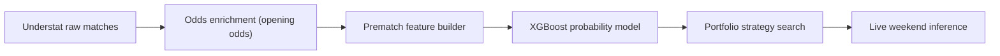

# Foot IA

Pipeline concentre sur un seul chemin utile :

1. recuperer les matchs bruts Understat
2. enrichir avec les cotes d'ouverture
3. construire un dataset strictement pre-match
4. chercher un portefeuille de strategies complementaires
5. lancer une inference live sur les matchs a venir

L'ancienne strategie unitaire a ete retiree du depot. Le projet documente maintenant uniquement le portefeuille multi-strategies encore utilise.

## Idee centrale

Le coeur du pipeline n'est pas de battre le marche sur tous les matchs.

La logique est :
- prendre le marche comme baseline forte
- estimer des probabilites pre-match avec un modele tabulaire
- comparer explicitement `p_modele` et `p_marche`
- ne jouer qu'une poche etroite de situations ou le desaccord semble exploitable

Autrement dit, on cherche des sous-regimes ou le marche parait legerement mal price, pas une recette universelle sur tout le 1X2.

## Pipeline



## Sources de donnees

- Matchs et stats : Understat
- Cotes historiques : [football-data.co.uk](https://www.football-data.co.uk/)
- Cotes live : Sportytrader via Playwright
- Cotes conservees dans le dataset : uniquement les cotes d'ouverture

Couverture actuelle :
- `21 128` matchs enrichis
- `1 291` matchs pour `season == 2025`
- `0` match `season == 2025` sans cotes d'ouverture completes

## Structure

- `Data/` : CSV bruts par equipe et saison
- `data_pipeline/` : ingestion Understat, matching, enrichissement cotes
- `train/` : dataset builder, modele, tuning, recherche de portefeuille, graphes README
- `inference/` : recuperation des cotes futures et predictions live
- `docs/` : figures du README

Fichiers cle :
- `data_pipeline/scrapper.py`
- `data_pipeline/market_data.py`
- `data_pipeline/enrich_data.py`
- `train/make_dataset.py`
- `train/ml_common.py`
- `train/strategy_search_common.py`
- `train/portfolio_strategy_search.py`
- `train/run_positive_strategy_portfolio.ps1`
- `train/run_exploratory_positive_strategy_portfolio.ps1`
- `train/generate_readme_figures.py`
- `inference/portfolio_presets.py`
- `inference/fetch_sportytrader_portfolio_odds.py`
- `inference/predict_upcoming_portfolio.py`
- `inference/upcoming_portfolio_strategy.py`
- `inference/run_upcoming_portfolio.ps1`
- `inference/run_weekend_predictions.ps1`

## Prerequis

Python 3.10+ avec :
- `pandas`
- `numpy`
- `requests`
- `tqdm`
- `scikit-learn`
- `xgboost`
- `matplotlib`

Pour l'inference live, Playwright doit aussi etre disponible sur la machine.

## Formulation

Le modele predit `P(home)`, `P(draw)`, `P(away)` pour chaque match.

Les cotes d'ouverture donnent :
- `market_home_win_odds_open`
- `market_draw_odds_open`
- `market_away_win_odds_open`

On derive ensuite :

```text
p_market_raw = 1 / odds
p_market = p_market_raw / sum(p_market_raw)
edge = p_model - p_market
expected_value = p_model * odds - 1
```

La strategie ne parie pas sur tous les matchs. Elle filtre seulement les cas ou `edge` et `expected_value` depassent des seuils definis pendant la recherche.

## Features du modele

Le selecteur est dans `train/ml_common.py`. Le modele utilise `51` features numeriques pre-match :
- 3 cotes d'ouverture brutes
- 9 variables marche derivees
- 13 variables de forme, repos, tendance et priors de saison precedente
- 24 variables matchup home-away sur fenetres `1`, `3`, `5` et versions carry
- 2 variables Elo

Liste exacte :

```text
market_home_win_odds_open
market_draw_odds_open
market_away_win_odds_open
rest_days_diff
rest_days_ratio
relative_form_5
relative_form_10
relative_form_5_carry
relative_form_10_carry
xG_efficiency_gap_5
xG_trend_gap
defensive_trend_gap
prev_season_points_per_game_gap
prev_season_xG_gap
prev_season_defensive_gap
season_points_per_game_gap
xG_advantage_1
defensive_advantage_1
deep_advantage_1
ppda_advantage_1
xG_advantage_1_carry
defensive_advantage_1_carry
deep_advantage_1_carry
ppda_advantage_1_carry
xG_advantage_3
defensive_advantage_3
deep_advantage_3
ppda_advantage_3
xG_advantage_3_carry
defensive_advantage_3_carry
deep_advantage_3_carry
ppda_advantage_3_carry
xG_advantage_5
defensive_advantage_5
deep_advantage_5
ppda_advantage_5
xG_advantage_5_carry
defensive_advantage_5_carry
deep_advantage_5_carry
ppda_advantage_5_carry
market_overround_open
market_home_prob_open
market_draw_prob_open
market_away_prob_open
market_home_minus_away_prob_open
market_non_draw_prob_open
market_favorite_prob_open
market_favorite_gap_open
market_entropy_open
elo_rating_gap
elo_win_probability
```

## Protocole scientifique

Deux cadres coexistent :
- `validation` : recherche sur `2024`, puis evaluation sur `2025/26`
- `test` : recherche exploratoire directement sur `2025/26` pour identifier plusieurs poches d'edge complementaires

Le preset live utilise aujourd'hui le portefeuille exploratoire, parce que c'est celui qui fournit plusieurs strategies actives en meme temps.

Le modele ne voit que des variables pre-match :
- stats historiques avec `shift(1)`
- rolling windows pre-match
- Elo lu avant mise a jour par le resultat
- cotes d'ouverture uniquement
- split temporel par saisons

## Portefeuille actuel

Strategies du preset live :
- `Bundesliga draw nonfavorite [2.20, 4.00)`
- `EPL draw nonfavorite [4.00, 10.00)`
- `Ligue 1 draw nonfavorite [2.00, 10.00)`
- `Serie A draw nonfavorite [4.00, 10.00)`

Exports conserves pour cette version :
- `train/output/positive_strategy_portfolio_summary_test_selected.csv`
- `train/output/positive_strategy_portfolio_bets_test_selected.csv`

Resultat exploratoire du portefeuille sur `2025/26` :

| Metrique | Valeur |
| --- | ---: |
| Strategies retenues | `4` |
| Paris selectionnes | `97` |
| Profit cumule | `+45.63` unites |
| ROI | `+47.04%` |
| Hit rate | `31.96%` |

## Graphiques

### Profit cumule du portefeuille

Montre si le resultat vient d'un seul gros coup ou d'une accumulation plus reguliere.


### Profit cumule par strategie

Permet de verifier si plusieurs strategies contribuent vraiment ou si une seule porte tout le portefeuille.


### ROI mensuel par ligue

Permet de voir si l'edge est concentre sur une seule ligue ou s'il se repartit.


### Contribution par strategie

Decompose profit, volume et ROI moyen de chaque composante du portefeuille.


Lecture correcte :
- le resultat est diversifie sur plusieurs strategies
- le preset live reste exploratoire
- il est utile operationnellement, pas encore etabli comme preuve definitive de robustesse

## Commandes utiles

Pipeline complet :

```powershell
powershell -ExecutionPolicy Bypass -File .\run_positive_roi_pipeline.ps1 -Trials 40
```

Recherche de portefeuille sur validation :

```powershell
powershell -ExecutionPolicy Bypass -File .\train\run_positive_strategy_portfolio.ps1 -Trials 12
```

Recherche exploratoire multi-strategies :

```powershell
powershell -ExecutionPolicy Bypass -File .\train\run_exploratory_positive_strategy_portfolio.ps1 -Trials 6
```

Regenerer les graphiques du README :

```powershell
python .\train\generate_readme_figures.py
```

Predire automatiquement le prochain week-end :

```powershell
powershell -ExecutionPolicy Bypass -File .\inference\run_weekend_predictions.ps1 -BankrollEur 50
```

Predire une plage de dates explicite :

```powershell
powershell -ExecutionPolicy Bypass -File .\inference\run_upcoming_portfolio.ps1 -DateFrom 2026-03-13 -DateTo 2026-03-16 -BankrollEur 50
```

## Notes

- Les datasets intermediaires ne sont pas versionnes.
- `train/dataset_home.csv` est regenere au besoin.
- Les sorties live sont regenerees dans `inference/output/`.
- Le portefeuille `validation` est le mode propre pour selectionner une strategie.
- Le portefeuille `test` sert a explorer plusieurs poches d'edge, pas a demontrer une robustesse statistique finale.
