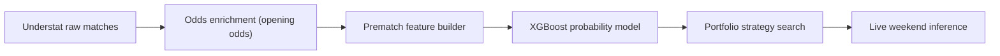

# ScorePredict

Projet de prediction foot centre sur une idee simple :

- recuperer des matchs historiques
- ajouter les cotes d'ouverture
- entrainer un modele pre-match
- comparer l'avis du modele a l'avis du marche
- ne parier que sur quelques cas tres filtres

L'ancienne strategie unitaire a ete retiree. Le depot garde maintenant uniquement le portefeuille multi-strategies encore utilise.

## En 30 secondes

Si on resume vraiment :

- le bookmaker donne deja une tres bonne estimation via les cotes
- le modele essaie de dire : "ici, la cote me parait un peu trop haute"
- on ne parie pas sur tous les matchs
- on garde seulement les matchs ou l'ecart entre modele et marche est assez fort
- au lieu d'une seule strategie, on combine plusieurs petites strategies

Le projet n'essaie donc pas de deviner tous les resultats.  
Il essaie juste de reperer quelques situations ou le marche semble legerement se tromper.

## L'idee de base

Le point cle, c'est de ne pas traiter les cotes comme un ennemi.

Les cotes sont deja une synthese enorme d'information :
- niveau des equipes
- absences
- forme recente
- perception du marche
- marge bookmaker

Donc le bon reflexe n'est pas :
- "je vais ignorer les cotes et faire mieux"

Le bon reflexe est :
- "je vais prendre les cotes comme point de depart"
- "je vais ajouter des infos foot utiles"
- "je vais regarder seulement les matchs ou mon modele n'est pas d'accord avec le marche"

## Pipeline



## D'ou viennent les donnees

- Matchs et stats : Understat
- Cotes historiques : [football-data.co.uk](https://www.football-data.co.uk/)
- Cotes live : Sportytrader via Playwright
- Cotes gardees dans le dataset : uniquement les cotes d'ouverture

Couverture actuelle :
- `21 128` matchs enrichis
- `1 291` matchs pour `season == 2025`
- `0` match `season == 2025` sans cotes d'ouverture completes

## Structure du depot

- `Data/` : CSV bruts par equipe et saison
- `data_pipeline/` : collecte et enrichissement de la data
- `train/` : generation dataset, modele, recherche de strategies, graphes
- `inference/` : predictions live pour les matchs a venir
- `docs/` : figures utilisees dans ce README

Les fichiers importants sont :
- `data_pipeline/scrapper.py`
- `data_pipeline/market_data.py`
- `data_pipeline/enrich_data.py`
- `train/make_dataset.py`
- `train/ml_common.py`
- `train/strategy_search_common.py`
- `train/portfolio_strategy_search.py`
- `train/validation_io.py`
- `train/clv_io.py`
- `train/clv_metrics.py`
- `train/validation_metrics.py`
- `train/validation_context.py`
- `train/validation_verdict.py`
- `train/validation_markdown.py`
- `train/scientific_validation_report.py`
- `train/run_positive_strategy_portfolio.ps1`
- `train/run_scientific_validation.ps1`
- `train/generate_readme_figures.py`
- `inference/portfolio_presets.py`
- `inference/live_tracking.py`
- `inference/fetch_sportytrader_portfolio_odds.py`
- `inference/predict_upcoming_portfolio.py`
- `inference/upcoming_portfolio_strategy.py`
- `inference/run_upcoming_portfolio.ps1`
- `inference/run_weekend_predictions.ps1`

## Ce que fait le modele, concretement

Le modele donne 3 probabilites pour chaque match :
- victoire domicile
- nul
- victoire exterieur

Le marche donne aussi son avis via les cotes.

Exemple simple :
- si la cote du nul est `4.00`, le marche dit en gros "le nul a autour de 25% de chances", avant correction de marge
- si le modele pense plutot `32%`
- alors il y a un ecart

Cet ecart ne suffit pas tout seul.
On regarde aussi :
- si l'esperance est positive
- si la cote est dans une plage interessante
- si le pari correspond a une strategie deja retenue

## Comment une decision est prise

Version tres simple :

1. Le modele regarde un match avant qu'il commence.
2. Il donne 3 probabilites :
- domicile
- nul
- exterieur
3. On compare ces 3 probabilites a celles du marche.
4. Si le modele voit un nul plus probable que le marche, on calcule si la cote paie assez.
5. Si ce match rentre dans une des 4 strategies du portefeuille, on garde le pari.
6. Sinon, on ne fait rien.

En clair, on ne demande pas au modele :
- "donne-moi un vainqueur a tout prix"

On lui demande :
- "est-ce qu'il y a ici un prix interessant, dans une zone que le backtest a deja validee ?"

Le calcul de base reste celui-ci :

```text
p_market_raw = 1 / odds
p_market = p_market_raw / sum(p_market_raw)
edge = p_model - p_market
expected_value = p_model * odds - 1
```

Version simple :
- `p_market` = ce que pense le marche
- `p_model` = ce que pense le modele
- `edge` = la difference entre les deux
- `expected_value` = est-ce que la cote paie assez par rapport a la proba du modele

La decision finale ressemble donc a une check-list :
- le modele aime l'issue
- le marche la paie assez
- la cote est dans la bonne plage
- l'issue n'est pas deja favorite si la strategie interdit de suivre le favori
- le match appartient a une ligue que la strategie couvre

Exemple concret :
- le marche voit le nul a `24%`
- le modele voit le nul a `31%`
- la cote du nul est `4.60`
- la strategie autorise les nuls entre `4.00` et `10.00`
- alors le match peut etre retenu

## Ce que regarde le modele

Le modele utilise `51` variables pre-match.  
En pratique, on peut les resumer en 4 blocs faciles a comprendre :

1. Les cotes d'ouverture
- elles donnent l'avis initial du marche

2. La forme recente
- resultats recents
- tendances xG
- efficacite offensive
- solidite defensive

3. Le matchup entre les deux equipes
- avantage offensif
- avantage defensif
- pression
- volume d'occasions

4. Le contexte long terme
- Elo
- niveau de la saison precedente
- carry d'une saison a l'autre
- repos entre deux matchs

La liste technique complete est plus bas si tu veux voir les noms exacts.

## Pourquoi ce n'est pas de la triche

Le modele ne voit jamais le futur.

Concretement :
- les stats d'un match ne servent qu'aux matchs suivants
- les rolling windows sont calculees avant le match a predire
- l'Elo est lu avant la mise a jour du resultat
- seules les cotes d'ouverture sont utilisees
- les saisons sont separees dans le temps

Donc quand on teste `2025/26`, le modele n'est pas entraine sur `2025/26`.

## Protocole de recherche

Le protocole de reference est maintenant le protocole strict.

Version simple :

1. On apprend d'abord a predire sur l'ancien historique.
2. Ensuite, on prend la saison `2024/25` comme terrain d'essai pour chercher quelles regles marchent le mieux.
3. Quand ces regles sont choisies, on les gele.
4. Puis on les envoie sur une nouvelle saison, `2025/26`, sans les modifier.

Le point important :
- la recherche se fait sur `2024/25`
- la verification se fait sur `2025/26`
- donc on ne choisit pas la strategie en regardant directement la saison test

En dates reelles, cela donne :
- train : jusqu'a la fin de `2023/24`
- validation : du `2024-08-15` au `2025-05-25`
- test : du `2025-08-15` au `2026-03-09`

Comment la recherche marche, tres concretement :

1. Le code entraine plusieurs modeles candidats.
2. Pour chaque modele, il teste beaucoup de regles de pari :
- quelle ligue jouer
- quel type d'issue jouer
- quelle plage de cotes accepter
- quel seuil minimum d'edge et d'expected value demander
3. Il garde seulement les strategies qui sont bonnes sur `2024/25`.
4. Parmi elles, il construit un portefeuille :
- pas trop de recouvrement
- pas de strategies qui se marchent dessus sur le meme match
- maximum `4` strategies
5. Ce portefeuille est ensuite teste tel quel sur `2025/26`.

C'est ce cadre qu'il faut lire quand on parle du portefeuille positif actuel.

## Portefeuille actuel

Le portefeuille de reference actuel est maintenant le portefeuille strict :
- strategies choisies sur `season == 2024`, donc la saison `2024/25`
- evaluation sur `season == 2025`, donc la saison `2025/26`
- pas de refit sur `2024/25` avant le test `2025/26`

Il combine 4 strategies :
- `Bundesliga local draw nonfavorite [4.00, 10.00)`
- `Bundesliga draw nonfavorite [2.00, 10.00)`
- `EPL draw nonfavorite [4.00, 10.00)`
- `La Liga draw nonfavorite [2.20, 4.00)`

En clair :
- on joue surtout des nuls
- pas quand cette issue est deja favorite
- avec des plages de cotes bien definies
- sur plusieurs ligues pour eviter de dependre d'une seule poche

Exports conserves :
- `train/output/positive_strategy_portfolio_summary.csv`
- `train/output/positive_strategy_portfolio_bets.csv`
- `train/output/positive_strategy_portfolio_bets_with_clv.csv`

Resultat du portefeuille strict sur `2025/26` :

| Metrique | Valeur |
| --- | ---: |
| Strategies retenues | `4` |
| Paris selectionnes | `181` |
| Profit cumule | `+35.76` unites |
| ROI | `+19.76%` |
| Hit rate | `29.83%` |

Lecture correcte :
- c'est le cadre methodologiquement propre
- il est plus defensable scientifiquement
- il reste cependant un backtest sur une seule saison test, donc pas une preuve finale pour le futur

## Exemples de paris gagnants en 2026

Pour rendre le resultat plus concret, voici des paris du portefeuille strict qui ont gagne en `2026`, c'est-a-dire entre le `1 janvier 2026` et le `9 mars 2026`.

Resume rapide :
- `29` paris gagnants sur cette periode
- `14` en `La Liga`
- `8` en `EPL`
- `7` en `Bundesliga`

Exemples marquants :

| Date | Ligue | Match | Pari | Cote | Profit |
| --- | --- | --- | --- | ---: | ---: |
| `2026-01-17` | `EPL` | `Liverpool vs Burnley` | `draw` | `6.50` | `+5.50` |
| `2026-01-31` | `Bundesliga` | `Hamburger SV vs Bayern Munich` | `draw` | `6.50` | `+5.50` |
| `2026-02-21` | `EPL` | `Chelsea vs Burnley` | `draw` | `6.50` | `+5.50` |
| `2026-03-04` | `EPL` | `Manchester City vs Nottingham Forest` | `draw` | `5.00` | `+4.00` |
| `2026-02-15` | `Bundesliga` | `RasenBallsport Leipzig vs Wolfsburg` | `draw` | `4.75` | `+3.75` |
| `2026-01-01` | `EPL` | `Liverpool vs Leeds` | `draw` | `4.45` | `+3.45` |
| `2026-01-08` | `EPL` | `Arsenal vs Liverpool` | `draw` | `4.35` | `+3.35` |
| `2026-02-10` | `EPL` | `Chelsea vs Leeds` | `draw` | `4.33` | `+3.33` |
| `2026-02-01` | `EPL` | `Tottenham vs Manchester City` | `draw` | `4.10` | `+3.10` |
| `2026-02-28` | `Bundesliga` | `Bayer Leverkusen vs Mainz 05` | `draw` | `4.00` | `+3.00` |
| `2026-02-21` | `La Liga` | `Real Sociedad vs Real Oviedo` | `draw` | `3.90` | `+2.90` |
| `2026-03-09` | `La Liga` | `Espanyol vs Real Oviedo` | `draw` | `3.40` | `+2.40` |

La liste complete est dans :
- `train/output/positive_strategy_portfolio_bets.csv`

Si tu filtres :
- `won_bet = True`
- `date >= 2026-01-01`

tu retrouves tous les paris gagnants de l'annee 2026 presents dans ce backtest.

## Comment on mesure la robustesse

On ne peut pas prouver mathematiquement que le portefeuille gagnera dans le futur.

En revanche, on peut mesurer si la preuve actuelle est faible, moyenne ou encourageante.
Le projet le fait maintenant avec un bloc separe de validation scientifique.

Le rapport regarde :
- le ROI observe
- un intervalle de confiance bootstrap sur le ROI
- la probabilite bootstrap que le ROI soit au-dessus de zero
- le hit rate
- le drawdown maximal
- la plus longue serie de pertes
- le mode de selection du portefeuille : `validation` ou `test`
- le `CLV` historique sur les matchs deja joues de `2025/26`

Important :
- les closing odds ne servent pas a l'entrainement
- elles sont rechargees a part, uniquement pour auditer les paris deja joues
- donc on garde bien un modele entraine avec les cotes d'ouverture seulement

Lecture simple :
- un ROI positif seul ne suffit pas
- si le portefeuille a ete choisi sur la meme saison qu'il gagne, la preuve reste faible
- si le portefeuille est choisi sur `2024/25`, puis teste ensuite sur `2025/26` sans refit intermediaire, la preuve est deja plus propre
- si en plus le CLV est positif sur ces matchs testes, la preuve devient plus serieuse

Aujourd'hui :
- le portefeuille strict choisi sur `2024/25` sort `+19.76%` de ROI sur `2025/26`
- le rapport scientifique enrichit maintenant les `181` paris testes sur `2025/26` avec leur closing line historique
- le `CLV` historique est lui aussi positif, donc le portefeuille ne gagne pas seulement sur les resultats, mais aussi contre la cloture

Donc la bonne suite, au `12 mars 2026`, c'est de geler la strategie live maintenant et de suivre uniquement la fin de saison `2025/26`.

Fichiers de rapport generes :
- `train/output/positive_strategy_portfolio_bets_scientific_report.md`
- `train/output/positive_strategy_portfolio_bets_scientific_report.json`

En live, chaque recommandation est aussi archivee ici :
- `inference/output/live_portfolio_bet_log.csv`

## Les graphiques, en version simple

### 1. Profit cumule du portefeuille

Question a laquelle ce graphe repond :
- "est-ce que tout vient d'un seul gros coup de chance ?"

S'il monte de facon relativement progressive, c'est plus rassurant qu'un seul pic isole.


### 2. Profit cumule par strategie

Question :
- "est-ce qu'une seule strategie fait tout le travail ?"

Si plusieurs lignes contribuent, le portefeuille est plus credible.


### 3. ROI mensuel par ligue

Question :
- "est-ce que l'edge existe partout ou seulement a un endroit ?"

Ca aide a voir si le signal est un minimum diversifie.


### 4. Contribution par strategie

Question :
- "qui apporte du volume, et qui apporte de la marge ?"

Ca permet de separer les strategies utiles de celles qui sont juste spectaculaires sur peu de paris.


## Les features exactes

Si tu veux le detail technique complet, voici les noms exacts utilises par le modele :

```text
market_home_win_odds_open
market_draw_odds_open
market_away_win_odds_open
rest_days_diff
rest_days_ratio
relative_form_5
relative_form_10
relative_form_5_carry
relative_form_10_carry
xG_efficiency_gap_5
xG_trend_gap
defensive_trend_gap
prev_season_points_per_game_gap
prev_season_xG_gap
prev_season_defensive_gap
season_points_per_game_gap
xG_advantage_1
defensive_advantage_1
deep_advantage_1
ppda_advantage_1
xG_advantage_1_carry
defensive_advantage_1_carry
deep_advantage_1_carry
ppda_advantage_1_carry
xG_advantage_3
defensive_advantage_3
deep_advantage_3
ppda_advantage_3
xG_advantage_3_carry
defensive_advantage_3_carry
deep_advantage_3_carry
ppda_advantage_3_carry
xG_advantage_5
defensive_advantage_5
deep_advantage_5
ppda_advantage_5
xG_advantage_5_carry
defensive_advantage_5_carry
deep_advantage_5_carry
ppda_advantage_5_carry
market_overround_open
market_home_prob_open
market_draw_prob_open
market_away_prob_open
market_home_minus_away_prob_open
market_non_draw_prob_open
market_favorite_prob_open
market_favorite_gap_open
market_entropy_open
elo_rating_gap
elo_win_probability
```

## Commandes utiles

Recherche de portefeuille stricte, sans refit sur `2024/25` avant le test `2025/26` :

```powershell
powershell -ExecutionPolicy Bypass -File .\train\run_positive_strategy_portfolio.ps1 -Trials 2 -TestFitScope train
```

Generer le rapport de validation scientifique :

```powershell
powershell -ExecutionPolicy Bypass -File .\train\run_scientific_validation.ps1
```

Regenerer les graphiques du README :

```powershell
python .\train\generate_readme_figures.py
```

Predire automatiquement le prochain week-end :

```powershell
powershell -ExecutionPolicy Bypass -File .\inference\run_weekend_predictions.ps1 -BankrollEur 50
```

Predire une plage de dates explicite :

```powershell
powershell -ExecutionPolicy Bypass -File .\inference\run_upcoming_portfolio.ps1 -DateFrom 2026-03-13 -DateTo 2026-03-16 -BankrollEur 50
```

## Notes

- Les datasets intermediaires ne sont pas versionnes.
- `train/dataset_home.csv` est regenere au besoin.
- Les sorties live sont regenerees dans `inference/output/`.
- `inference/output/live_portfolio_bet_log.csv` sert a figer les paris recommandes au moment ou ils sont proposes.
- Le protocole de reference est maintenant le split strict `train < 2024 / validation = 2024 / test = 2025`.
- Les closing odds servent uniquement a l'audit `CLV`, jamais a l'entrainement.
- Le vrai test prospectif propre a partir d'aujourd'hui est la fin de saison `2025/26`, pas un backtest reouvert apres coup.
