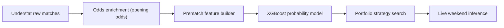
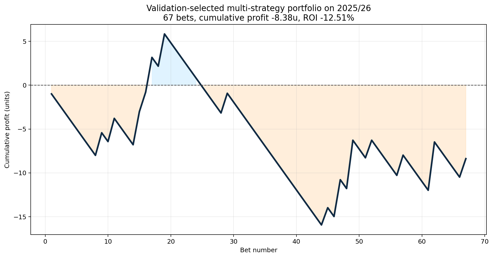
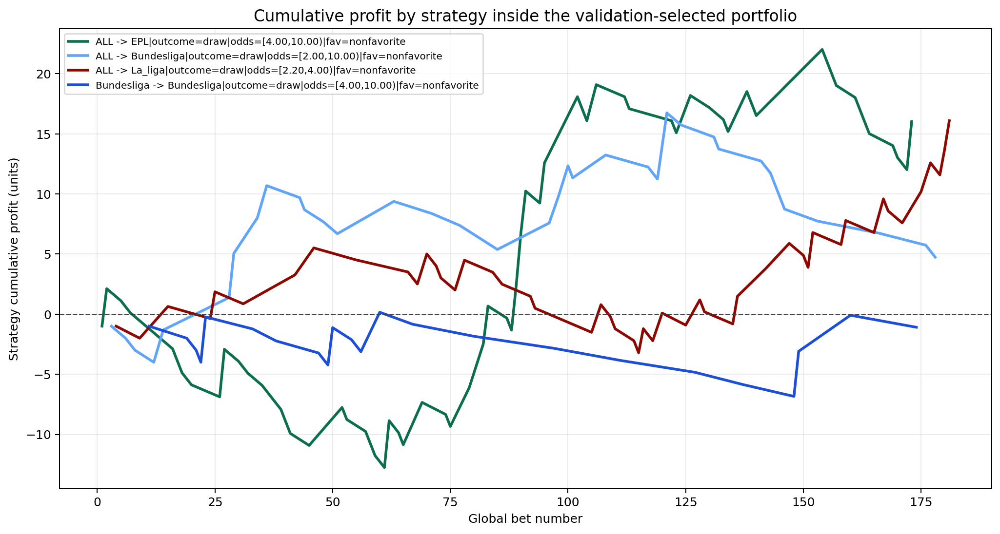
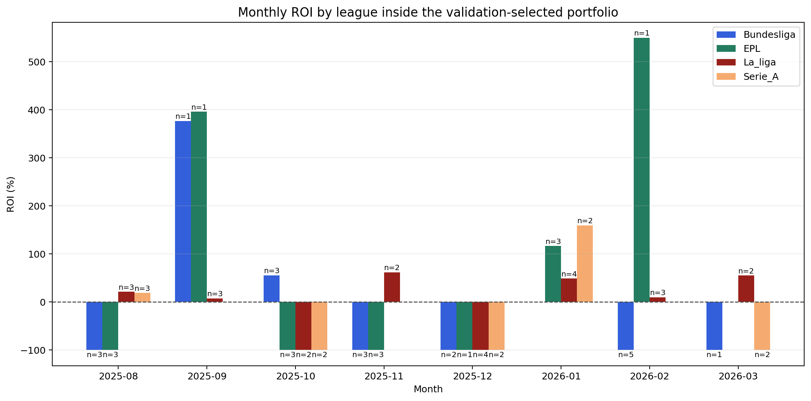
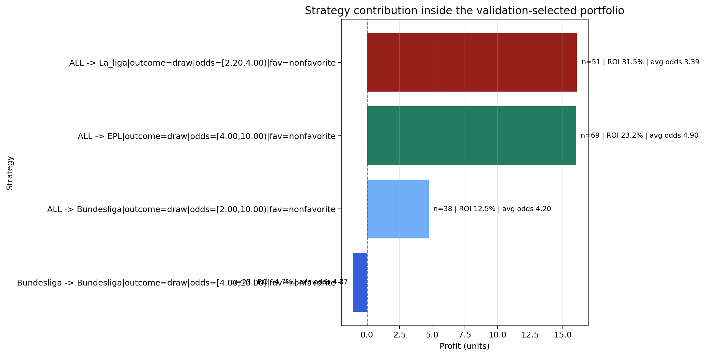

# Foot IA

Projet de prediction foot centre sur une idee simple :

- recuperer des matchs historiques
- ajouter les cotes d'ouverture
- entrainer un modele pre-match
- comparer l'avis du modele a l'avis du marche
- ne parier que sur quelques cas tres filtres

L'ancienne strategie unitaire a ete retiree. Le depot garde maintenant uniquement le portefeuille multi-strategies encore utilise.

## En 30 secondes

Si on resume vraiment :

- le bookmaker donne deja une tres bonne estimation via les cotes
- le modele essaie de dire : "ici, la cote me parait un peu trop haute"
- on ne parie pas sur tous les matchs
- on garde seulement les matchs ou l'ecart entre modele et marche est assez fort
- au lieu d'une seule strategie, on combine plusieurs petites strategies

Le projet n'essaie donc pas de deviner tous les resultats.  
Il essaie juste de reperer quelques situations ou le marche semble legerement se tromper.

## L'idee de base

Le point cle, c'est de ne pas traiter les cotes comme un ennemi.

Les cotes sont deja une synthese enorme d'information :
- niveau des equipes
- absences
- forme recente
- perception du marche
- marge bookmaker

Donc le bon reflexe n'est pas :
- "je vais ignorer les cotes et faire mieux"

Le bon reflexe est :
- "je vais prendre les cotes comme point de depart"
- "je vais ajouter des infos foot utiles"
- "je vais regarder seulement les matchs ou mon modele n'est pas d'accord avec le marche"

## Pipeline



## D'ou viennent les donnees

- Matchs et stats : Understat
- Cotes historiques : [football-data.co.uk](https://www.football-data.co.uk/)
- Cotes live : Sportytrader via Playwright
- Cotes gardees dans le dataset : uniquement les cotes d'ouverture

Couverture actuelle :
- `21 128` matchs enrichis
- `1 291` matchs pour `season == 2025`
- `0` match `season == 2025` sans cotes d'ouverture completes

## Structure du depot

- `Data/` : CSV bruts par equipe et saison
- `data_pipeline/` : collecte et enrichissement de la data
- `train/` : generation dataset, modele, recherche de strategies, graphes
- `inference/` : predictions live pour les matchs a venir
- `docs/` : figures utilisees dans ce README

Les fichiers importants sont :
- `data_pipeline/scrapper.py`
- `data_pipeline/market_data.py`
- `data_pipeline/enrich_data.py`
- `train/make_dataset.py`
- `train/ml_common.py`
- `train/strategy_search_common.py`
- `train/portfolio_strategy_search.py`
- `train/run_positive_strategy_portfolio.ps1`
- `train/run_exploratory_positive_strategy_portfolio.ps1`
- `train/generate_readme_figures.py`
- `inference/portfolio_presets.py`
- `inference/fetch_sportytrader_portfolio_odds.py`
- `inference/predict_upcoming_portfolio.py`
- `inference/upcoming_portfolio_strategy.py`
- `inference/run_upcoming_portfolio.ps1`
- `inference/run_weekend_predictions.ps1`

## Ce que fait le modele, concretement

Le modele donne 3 probabilites pour chaque match :
- victoire domicile
- nul
- victoire exterieur

Le marche donne aussi son avis via les cotes.

Exemple simple :
- si la cote du nul est `4.00`, le marche dit en gros "le nul a autour de 25% de chances", avant correction de marge
- si le modele pense plutot `32%`
- alors il y a un ecart

Cet ecart ne suffit pas tout seul.
On regarde aussi :
- si l'esperance est positive
- si la cote est dans une plage interessante
- si le pari correspond a une strategie deja retenue

## Comment une decision est prise

Le calcul important est celui-ci :

```text
p_market_raw = 1 / odds
p_market = p_market_raw / sum(p_market_raw)
edge = p_model - p_market
expected_value = p_model * odds - 1
```

Version simple :
- `p_market` = ce que pense le marche
- `p_model` = ce que pense le modele
- `edge` = la difference entre les deux
- `expected_value` = est-ce que la cote paie assez par rapport a la proba du modele

Le pipeline ne parie donc pas "par instinct".
Il dit plutot :
- "mon modele voit plus de chances que le marche"
- "la cote paie assez"
- "ce type de match a deja bien fonctionne dans la recherche"

## Ce que regarde le modele

Le modele utilise `51` variables pre-match.  
En pratique, on peut les resumer en 4 blocs faciles a comprendre :

1. Les cotes d'ouverture
- elles donnent l'avis initial du marche

2. La forme recente
- resultats recents
- tendances xG
- efficacite offensive
- solidite defensive

3. Le matchup entre les deux equipes
- avantage offensif
- avantage defensif
- pression
- volume d'occasions

4. Le contexte long terme
- Elo
- niveau de la saison precedente
- carry d'une saison a l'autre
- repos entre deux matchs

La liste technique complete est plus bas si tu veux voir les noms exacts.

## Pourquoi ce n'est pas de la triche

Le modele ne voit jamais le futur.

Concretement :
- les stats d'un match ne servent qu'aux matchs suivants
- les rolling windows sont calculees avant le match a predire
- l'Elo est lu avant la mise a jour du resultat
- seules les cotes d'ouverture sont utilisees
- les saisons sont separees dans le temps

Donc quand on teste `2025/26`, le modele n'est pas entraine sur `2025/26`.

## Deux niveaux de recherche

Il y a 2 facons de chercher des strategies dans le projet.

### 1. Le mode validation

C'est le mode propre.

Idee :
- on cherche les regles sur `2024`
- on les gele
- on regarde ensuite ce que ca donne sur `2025/26`

C'est le mode a privilegier si on veut etre rigoureux.

### 2. Le mode exploratoire

C'est le mode plus agressif.

Idee :
- on cherche directement plusieurs poches positives sur `2025/26`
- on les combine dans un portefeuille

Ce mode est utile pour faire tourner une inference live maintenant, mais il est moins fort scientifiquement.

## Portefeuille actuel

Le preset live actuel combine 4 strategies :
- `Bundesliga draw nonfavorite [2.20, 4.00)`
- `EPL draw nonfavorite [4.00, 10.00)`
- `Ligue 1 draw nonfavorite [2.00, 10.00)`
- `Serie A draw nonfavorite [4.00, 10.00)`

En clair :
- on joue surtout des nuls
- pas quand cette issue est deja favorite
- avec des plages de cotes bien definies
- sur plusieurs ligues pour eviter de dependre d'une seule poche

Exports conserves :
- `train/output/positive_strategy_portfolio_summary_test_selected.csv`
- `train/output/positive_strategy_portfolio_bets_test_selected.csv`

Resultat exploratoire observe sur `2025/26` :

| Metrique | Valeur |
| --- | ---: |
| Strategies retenues | `4` |
| Paris selectionnes | `97` |
| Profit cumule | `+45.63` unites |
| ROI | `+47.04%` |
| Hit rate | `31.96%` |

Lecture correcte :
- c'est interessant
- c'est exploitable pour de l'inference live
- mais ce n'est pas encore une preuve finale de robustesse

## Les graphiques, en version simple

### 1. Profit cumule du portefeuille

Question a laquelle ce graphe repond :
- "est-ce que tout vient d'un seul gros coup de chance ?"

S'il monte de facon relativement progressive, c'est plus rassurant qu'un seul pic isole.



### 2. Profit cumule par strategie

Question :
- "est-ce qu'une seule strategie fait tout le travail ?"

Si plusieurs lignes contribuent, le portefeuille est plus credible.



### 3. ROI mensuel par ligue

Question :
- "est-ce que l'edge existe partout ou seulement a un endroit ?"

Ca aide a voir si le signal est un minimum diversifie.



### 4. Contribution par strategie

Question :
- "qui apporte du volume, et qui apporte de la marge ?"

Ca permet de separer les strategies utiles de celles qui sont juste spectaculaires sur peu de paris.



## Les features exactes

Si tu veux le detail technique complet, voici les noms exacts utilises par le modele :

```text
market_home_win_odds_open
market_draw_odds_open
market_away_win_odds_open
rest_days_diff
rest_days_ratio
relative_form_5
relative_form_10
relative_form_5_carry
relative_form_10_carry
xG_efficiency_gap_5
xG_trend_gap
defensive_trend_gap
prev_season_points_per_game_gap
prev_season_xG_gap
prev_season_defensive_gap
season_points_per_game_gap
xG_advantage_1
defensive_advantage_1
deep_advantage_1
ppda_advantage_1
xG_advantage_1_carry
defensive_advantage_1_carry
deep_advantage_1_carry
ppda_advantage_1_carry
xG_advantage_3
defensive_advantage_3
deep_advantage_3
ppda_advantage_3
xG_advantage_3_carry
defensive_advantage_3_carry
deep_advantage_3_carry
ppda_advantage_3_carry
xG_advantage_5
defensive_advantage_5
deep_advantage_5
ppda_advantage_5
xG_advantage_5_carry
defensive_advantage_5_carry
deep_advantage_5_carry
ppda_advantage_5_carry
market_overround_open
market_home_prob_open
market_draw_prob_open
market_away_prob_open
market_home_minus_away_prob_open
market_non_draw_prob_open
market_favorite_prob_open
market_favorite_gap_open
market_entropy_open
elo_rating_gap
elo_win_probability
```

## Commandes utiles

Pipeline complet :

```powershell
powershell -ExecutionPolicy Bypass -File .\run_positive_roi_pipeline.ps1 -Trials 40
```

Recherche de portefeuille sur validation :

```powershell
powershell -ExecutionPolicy Bypass -File .\train\run_positive_strategy_portfolio.ps1 -Trials 12
```

Recherche exploratoire multi-strategies :

```powershell
powershell -ExecutionPolicy Bypass -File .\train\run_exploratory_positive_strategy_portfolio.ps1 -Trials 6
```

Regenerer les graphiques du README :

```powershell
python .\train\generate_readme_figures.py
```

Predire automatiquement le prochain week-end :

```powershell
powershell -ExecutionPolicy Bypass -File .\inference\run_weekend_predictions.ps1 -BankrollEur 50
```

Predire une plage de dates explicite :

```powershell
powershell -ExecutionPolicy Bypass -File .\inference\run_upcoming_portfolio.ps1 -DateFrom 2026-03-13 -DateTo 2026-03-16 -BankrollEur 50
```

## Notes

- Les datasets intermediaires ne sont pas versionnes.
- `train/dataset_home.csv` est regenere au besoin.
- Les sorties live sont regenerees dans `inference/output/`.
- Le mode `validation` est le plus propre pour selectionner une strategie.
- Le mode `test` sert surtout a explorer plusieurs poches d'edge complementaires.
