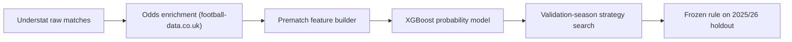
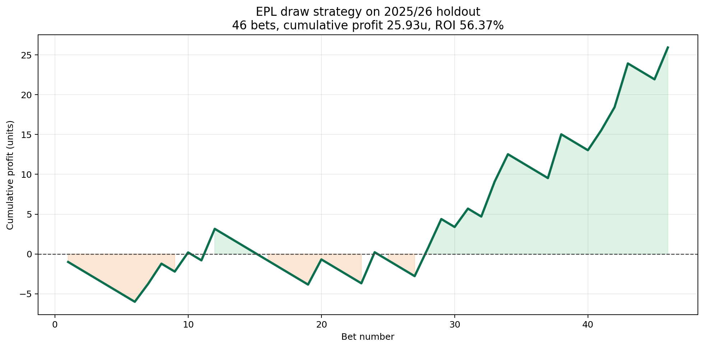
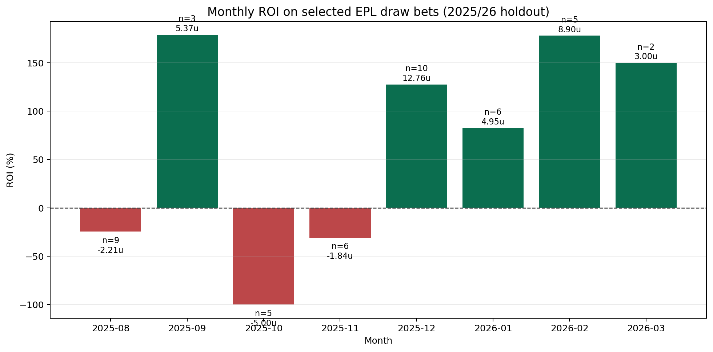
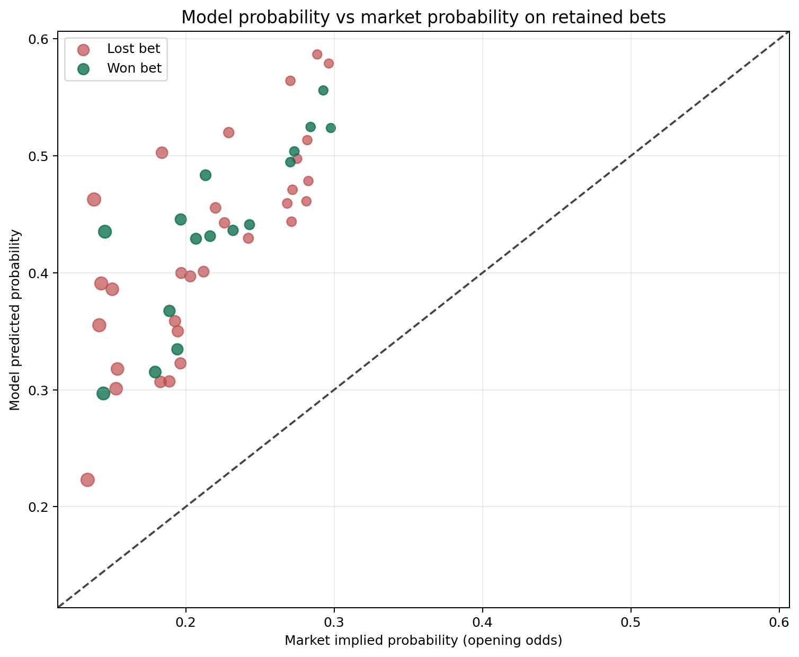

# Foot IA

Pipeline minimal et reproductible pour aller :

1. de la data brute Understat
2. a l'enrichissement par cotes d'ouverture
3. a un dataset pre-match sans fuite
4. a une strategie de pari filtree
5. a une evaluation hors echantillon sur la saison 2025/26

Le depot est volontairement concentre sur le chemin utile. Les datasets intermediaires et la plupart des exports sont regeneres a la demande.

## Idee centrale

Le "genie" ici n'est pas de battre le marche sur tous les matchs.

L'idee utile est plus simple :
- prendre le marche comme baseline tres forte
- estimer une probabilite pre-match avec un modele qui voit plus que la cote brute
- mesurer les cas ou le modele et le marche divergent vraiment
- ne parier que dans une niche etroite ou cette divergence est historiquement exploitable

Autrement dit, on ne cherche pas "le meilleur pronostic 1X2 global".
On cherche "une poche de desaccord modele vs marche" qui reste interessante hors entrainement.

## Ce que le pipeline fait



## Sources de donnees

- Matchs et stats : Understat
- Cotes : [football-data.co.uk](https://www.football-data.co.uk/)
- Cotes conservees : uniquement les cotes d'ouverture

Couverture actuelle :
- `21 128` matchs enrichis
- `20 978` matchs rapproches a date exacte
- `146` matchs rapproches a `J+/-1`
- `2` matchs rapproches a `J+/-2`
- `2` matchs rapproches a `J+11`
- `1` match sans cotes d'ouverture completes
- `1 291` matchs pour `season == 2025`
- `0` match `season == 2025` sans cotes d'ouverture completes

## Structure du depot

- `Data/` : CSV bruts par equipe et saison
- `scrapper.py` : recuperation Understat
- `market_data.py` : matching matchs + injection tirs/cotes
- `enrich_data.py` : enrichissement de tous les CSV de `Data/`
- `train/make_dataset.py` : construction du dataset match-level pre-match
- `train/ml_common.py` : selection de features, split, modele XGBoost, evaluation
- `train/train_model.py` : entrainement/evaluation 1X2 standard
- `train/tune_model.py` : tuning XGBoost
- `train/seasonal_protocol.py` : protocole train/val/test par saisons
- `train/walkforward_monthly.py` : walk-forward mensuel
- `train/filtered_strategy_search.py` : recherche de strategie de pari filtree
- `train/run_positive_epl_draw.ps1` : runner de la strategie positive retenue
- `train/generate_readme_figures.py` : regeneration des figures du README
- `docs/` : figures generees pour le README

## Prerequis

Python 3.10+ avec :
- `pandas`
- `numpy`
- `requests`
- `tqdm`
- `scikit-learn`
- `xgboost`
- `matplotlib`

## Formulation du probleme

Le modele predit `P(L)`, `P(D)`, `P(W)` pour chaque match.

Le marche donne trois cotes d'ouverture :
- `market_home_win_odds_open`
- `market_draw_odds_open`
- `market_away_win_odds_open`

On derive ensuite :

```text
p_market_raw = 1 / odds
p_market = p_market_raw / sum(p_market_raw)
edge = p_model - p_market
expected_value = p_model * odds - 1
```

Ensuite, on ne garde pas tous les matchs.
On applique une regle de selection sur la saison de validation, puis on gele cette regle avant le test futur.

## Pourquoi cette approche peut sortir un ROI positif

Le marche est deja tres bon. Donc :
- utiliser seulement des features "football" sans marche donne rarement un edge stable
- utiliser seulement les cotes revient a copier le bookmaker
- la bonne approche est de combiner les deux, puis filtrer fort

Ici, la strategie positive retenue repose sur 4 idees :
- le modele utilise les cotes d'ouverture comme prior
- il ajoute des signaux pre-match sur forme, xG, pression, Elo et carry inter-saisons
- il compare explicitement probabilite modele vs probabilite implicite du marche
- il ne parie que dans une niche tres precise : `EPL + draw + nonfavorite + edge minimum + EV minimum`

## Features utilisees par le modele

Le selecteur de features est dans `train/ml_common.py`.
La strategie positive utilise `51` features numeriques pre-match.

Familles de features :
- 3 cotes d'ouverture brutes
- 9 features marche derivees des cotes
- 13 features de forme, repos, tendances et priors de saison precedente
- 24 features matchup home-away sur fenetres `1`, `3`, `5` et versions carry
- 2 features Elo

Liste exacte :

```text
market_home_win_odds_open
market_draw_odds_open
market_away_win_odds_open
rest_days_diff
rest_days_ratio
relative_form_5
relative_form_10
relative_form_5_carry
relative_form_10_carry
xG_efficiency_gap_5
xG_trend_gap
defensive_trend_gap
prev_season_points_per_game_gap
prev_season_xG_gap
prev_season_defensive_gap
season_points_per_game_gap
xG_advantage_1
defensive_advantage_1
deep_advantage_1
ppda_advantage_1
xG_advantage_1_carry
defensive_advantage_1_carry
deep_advantage_1_carry
ppda_advantage_1_carry
xG_advantage_3
defensive_advantage_3
deep_advantage_3
ppda_advantage_3
xG_advantage_3_carry
defensive_advantage_3_carry
deep_advantage_3_carry
ppda_advantage_3_carry
xG_advantage_5
defensive_advantage_5
deep_advantage_5
ppda_advantage_5
xG_advantage_5_carry
defensive_advantage_5_carry
deep_advantage_5_carry
ppda_advantage_5_carry
market_overround_open
market_home_prob_open
market_draw_prob_open
market_away_prob_open
market_home_minus_away_prob_open
market_non_draw_prob_open
market_favorite_prob_open
market_favorite_gap_open
market_entropy_open
elo_rating_gap
elo_win_probability
```

## Protocole experimental retenu

La version positive gardee ne s'entraine jamais sur `2025/26`.

Split de travail pour la strategie `EPL draw` :
- train : EPL, saisons `< 2024` -> `3 800` lignes
- validation : EPL, saison `2024` -> `380` lignes
- pretest refit : EPL, saisons `<= 2024` -> `4 180` lignes
- test final : EPL, saison `2025` -> `291` lignes

Procedure :
1. echantillonner des hyperparametres XGBoost aleatoires
2. entrainer sur `train`
3. predire `validation`
4. chercher la meilleure regle de filtre sur `validation`
5. geler cette regle
6. re-entrainer une seule fois sur `pretest`
7. tester une seule fois sur `2025/26`

La regle finale retenue est :
- ligue d'entrainement : `EPL`
- ligue de pari : `EPL`
- issue jouee : `draw`
- `expected_value > 0.55`
- `edge >= 0.08`
- `2.0 <= odds < 10.0`
- le `draw` ne doit pas etre le favori du marche

Commande pour relancer exactement cette experience :

```powershell
powershell -ExecutionPolicy Bypass -File .\train\run_positive_epl_draw.ps1
```

## Resultat hors echantillon retenu

Resultat sur la saison `2025/26`, sans entrainement sur cette saison :

| Metrique | Valeur |
| --- | ---: |
| Matchs test EPL | `291` |
| Paris selectionnes | `46` |
| Profit cumule | `+25.93` unites |
| ROI | `+56.37%` |
| Hit rate | `34.78%` |
| Cote moyenne | `4.65` |
| Probabilite modele moyenne | `42.84%` |
| Probabilite marche moyenne | `21.85%` |
| Edge moyen | `+0.2098` |
| EV moyen | `+0.9230` |

Export conserve :
- `train/output/positive_epl_draw_bets.csv`

## Graphiques

### 1. Profit cumule sur la saison test

Le profit est negatif au debut, puis la courbe remonte nettement a partir de decembre. C'est utile pour voir si le resultat repose sur un seul outlier ou sur plusieurs gains repartis dans le temps.



### 2. ROI mensuel

Le profil mensuel reste bruite, ce qui est normal avec `46` paris seulement. Le signal positif vient surtout de decembre, janvier, fevrier et mars.



### 3. Probabilite modele vs probabilite marche

Chaque point est un pari retenu. La diagonale represente `p_model = p_market`. Les paris selectionnes sont au-dessus de cette ligne, donc dans une zone ou le modele voit plus de probabilite que le marche.



## Ce que ces graphiques montrent

Scientifiquement, ils montrent trois choses :
- la strategie n'est pas une simple copie des cotes, car les paris retenus vivent dans une zone de desaccord modele-marche
- le resultat positif ne vient pas d'un seul match, mais d'une serie de paris accumules
- l'edge reste tres concentre et ne doit pas etre generalise a tous les matchs ou a toutes les ligues

## Anti-fuite de donnees

Le pipeline a ete verifie pour rester strictement pre-match :
- `result` et `target` sont exclus des features
- les historiques de stats utilisent `shift(1)` et des rolling pre-match
- les streaks et moyennes sont stockes avant integration du match courant
- l'Elo est lu avant mise a jour par le resultat
- seules les cotes d'ouverture sont utilisees
- les splits sont chronologiques
- les splits standards sont groupes par `match_id`
- dans la strategie positive, `2025/26` sert uniquement de test final

Point de vigilance connu :
- le selecteur garde toutes les colonnes numeriques prefixees `market_`
- aujourd'hui elles sont toutes pre-match
- si de nouvelles colonnes `market_*` apparaissent un jour, il faudra les whitelister explicitement

## Ce que le resultat prouve, et ce qu'il ne prouve pas

Ce que le resultat prouve :
- il existe au moins une strategie positive sur `2025/26` sans entrainement sur cette saison
- cette strategie est reproductible avec le code du depot
- elle est basee sur un protocole temporel coherent

Ce qu'il ne prouve pas encore :
- que le ROI restera positif sur toutes les saisons futures
- que la strategie survivra a une recherche plus large sans data snooping
- que `46` paris suffisent pour conclure a une vraie inefficience structurelle

La lecture scientifique correcte est donc :
- resultat interessant
- protocole defendable
- evidence encourageante
- robustesse encore a confirmer sur plus de saisons futures ou en paper trading live

## Commandes utiles

Pipeline complet :

```powershell
powershell -ExecutionPolicy Bypass -File .\run_positive_roi_pipeline.ps1 -Trials 40
```

Strategie positive retenue :

```powershell
powershell -ExecutionPolicy Bypass -File .\train\run_positive_epl_draw.ps1
```

Regenerer les graphiques du README :

```powershell
python .\train\generate_readme_figures.py
```

## Notes

- Les datasets intermediaires ne sont pas versionnes.
- `train/dataset_home.csv` est regenere au besoin.
- Le depot garde le CSV final des paris positifs pour documenter le resultat retenu.
